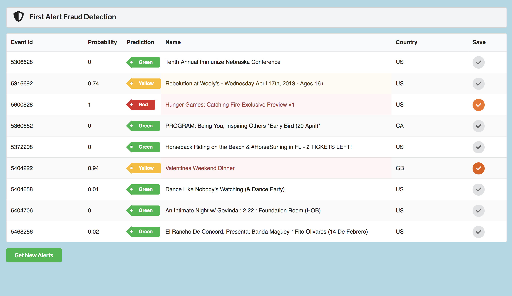

##Fraud Detection Dashboard

**Project**

Create a dashboard using React to display modeled data from a small group of Data Scientist. The purpose of the data is to predict potential fraud in events.

- This project was a collaboration of working between data science and web development.
- One of the challenges faced was obtaining usable data in order to display it in a format that can be scanned quickly.
- In order to save potential fraud to be reviewed later, the user can "check" the event.

**Screenshot**

<!-- deployed -->
<!-- 

 -->

---

Built by @CorriMori during Galvanize’s Web Development Immersive.
